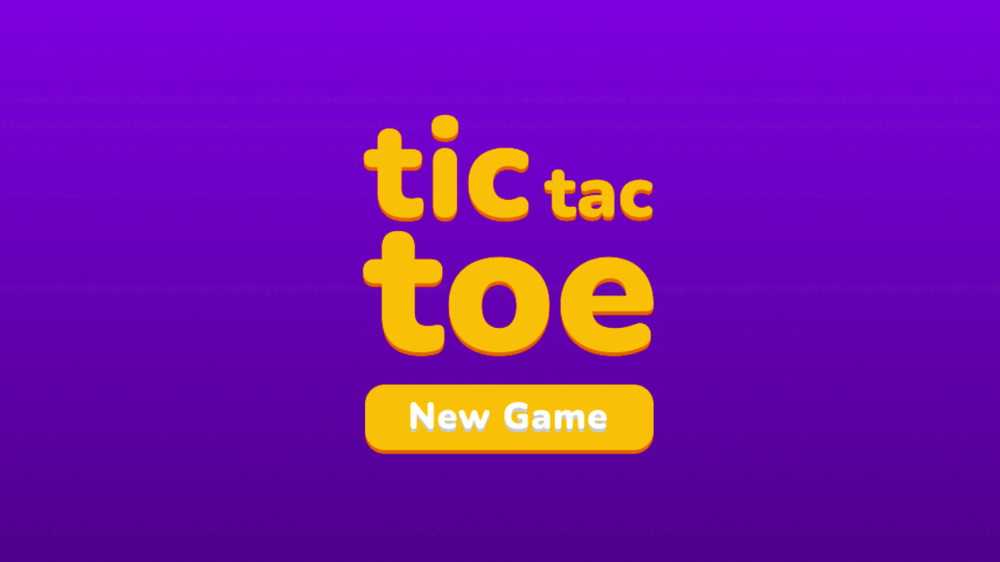

<h1 align="center">
    🕹️ TicTacToe - Game
</h1>

    
    
    
    
    

    

<a href="./newGame.html">Click to visit the project</a>

> Authorial project developed with the help of Figma for UX/UI design.

<h2>
    💻 about
</h2>

I created this project to expand my knowledge and skills in front-end web development.

---

<h2>
    🧠 Technologies used
</h2>

I used the following technologies to develop this project:

- HTML
- CSS
- SASS
- JAVASCRIPT
- FIGMA(UX/UI)

---

<h2>
    👨🏻‍💻 Developer
</h2>

Responsible for the project

<table>
  <tr>
    <td align="center">
      <a href="#" title="defina o titulo do link">
         
        
          <b>Diego Evertony</b>
        
      </a>
    </td>
</table>

---

<h2>
    📝 License
</h2>

This project is under license. See the [LICENSE](LICENSE.md) file for more details.
